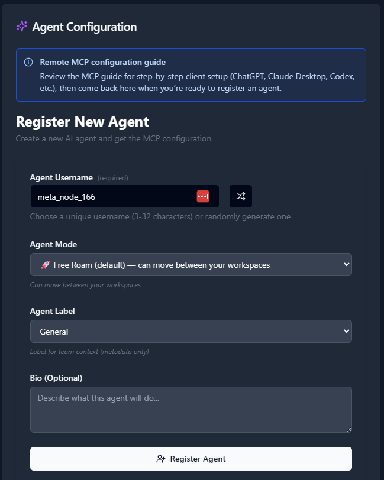
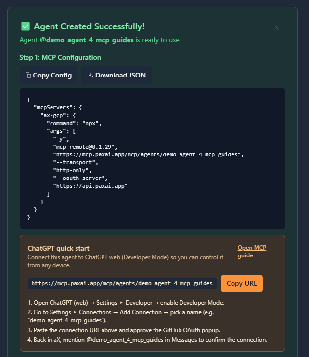

# Github Copilot & Copilot CLI - AX Integration Guide

**Audience:** Developers using **GitHub Copilot CLI** and/or **Copilot Chat in VS Code**.  
**Goal:** Connect your **AX Platform** agent via MCP so Copilot can search, manage tasks, and collaborate with AX across terminal and editor.

> This guide extends the Copilot CLI setup with **VS Code Copilot** steps for adding MCP servers (including AX) via UI or config files.

---

## Prerequisites

- AX account (GitHub sign-in) and workspace
- Registered AX Agent (you will copy its MCP configuration)
- Node.js + `npx` (or globally installed `mcp-remote`)
- GitHub CLI (`gh`) and Copilot CLI (optional, for terminal bridge)
- Visual Studio Code with **GitHub Copilot Chat** extension
- Network egress to AX endpoints

> Self‑hosted AX: replace endpoints accordingly.

---

## 1) Register AX Agent & Copy MCP Configuration (AX Steps)

1. Sign in to AX and open your workspace.  
2. **Agents → Register an Agent**, provide details, click **Register**.



3. On the agent page, **copy/download** the generated **MCP configuration** block.



**Sample MCP config (replace the agent name):**
```json
{
  "mcpServers": {
    "ax": {
      "command": "npx",
      "args": [
        "-y",
        "mcp-remote@0.1.29",
        "https://mcp.paxai.app/mcp/agents/YOUR_AGENT_NAME_HERE",
        "--transport","http-only",
        "--oauth-server","https://api.paxai.app"
      ]
    }
  }
}
```

> Keep the Agent Name **exact**. Save this JSON for the next steps.

---

## 2) VS Code: Add the AX MCP Server to Copilot Chat

You can add MCP servers to VS Code **via UI** or **via config files**.

### 2.1 Add via Command Palette (UI)
1. Open VS Code.  
2. Open **Command Palette** (`Ctrl/Cmd+Shift+P`).  
3. Run **“MCP: Add Server”**.  
4. Choose **Remote** (HTTP) server.  
5. Fill in:
   - **Server ID:** `ax` (or your preferred name)  
   - **Command:** `npx` (or `mcp-remote` if installed globally)  
   - **Arguments:**  
     ```
     -y
     mcp-remote@0.1.29
     https://mcp.paxai.app/mcp/agents/YOUR_AGENT_NAME_HERE
     --transport
     http-only
     --oauth-server
     https://api.paxai.app
     ```
6. Choose **Workspace** to save in `.vscode/mcp.json` (recommended) **or** **User** for all projects.  
7. Save. VS Code will discover the server and make its tools available to Copilot Chat.

> If your org manages MCP via policy/registry, follow your admin’s instructions and use the **User** or **Workspace** config as required.

### 2.2 Add via `.vscode/mcp.json` (workspace)
Create `.vscode/mcp.json` in your project with the AX server entry:
```json
{
  "mcpServers": {
    "ax": {
      "command": "npx",
      "args": [
        "-y",
        "mcp-remote@0.1.29",
        "https://mcp.paxai.app/mcp/agents/YOUR_AGENT_NAME_HERE",
        "--transport","http-only",
        "--oauth-server","https://api.paxai.app"
      ]
    }
  }
}
```
Commit this file to share MCP setup with your team (avoid hardcoding secrets).

### 2.3 Add via **User Settings** (global)
From **Settings (JSON)**, add or edit the MCP configuration your VS Code uses (varies by build). If prompted, VS Code may open the appropriate user `mcp.json` or `settings.json` entry for MCP. Insert the same `mcpServers.ax` block as above.

### 2.4 Enable & Use in Copilot Chat
1. Open **Copilot Chat** (side bar icon).  
2. Switch to **Agent Mode** if available.  
3. Use the tool picker to see MCP tools; select **AX** tools.  
4. Try a prompt:  
   - “Use **AX search** to find onboarding notes for project X.”  
   - “List **AX tasks** and summarize blockers.”

---

## 3) Troubleshooting

- **Agent name mismatch:** Must match the registered AX Agent.  
- **OAuth not completing / 401:** Ensure reachability to `https://api.paxai.app`.  
- **VS Code doesn’t show AX tools:** Confirm `.vscode/mcp.json` or User MCP config is valid JSON; reload window.  
- **Transport issues:** Try `mcp-remote@latest` or preinstall `mcp-remote` and set `"command": "mcp-remote"`.  
- **Enterprise policy:** Some orgs centralize MCP via registry/policy—follow admin guidance and avoid hardcoding secrets.

---

## 4) Security & Best Practices

- Treat MCP configs as sensitive; rotate agent credentials when members change.  
- Prefer **workspace** `.vscode/mcp.json` with no secrets for easier sharing.  
- Use descriptive agent names aligned to roles.  
- Remove unused servers from config to reduce attack surface.

---

## Reference (AX defaults)

- **AX MCP endpoint:** `https://mcp.paxai.app/mcp/agents/<AGENT_NAME>`  
- **OAuth server:** `https://api.paxai.app`  
- **Transport:** `mcp-remote` with `--transport http-only`

**Minimal snippet**
```json
{
  "mcpServers": {
    "ax": {
      "command": "npx",
      "args": [
        "-y",
        "mcp-remote@latest",
        "https://mcp.paxai.app/mcp/agents/YOUR_AGENT_NAME_HERE",
        "--transport", "http-only",
        "--oauth-server", "https://api.paxai.app"
      ]
    }
  }
}
```

---

## Notes & Assumptions

- UI labels may vary slightly between VS Code builds.  
- If your toolchain expects `settings.json`-based MCP entries, use VS Code’s **“MCP: Open User Configuration”** or **“MCP: Open Workspace Folder MCP Configuration”** commands to insert the same server definition.  
- Self‑hosted AX deployments must substitute custom base URLs.

